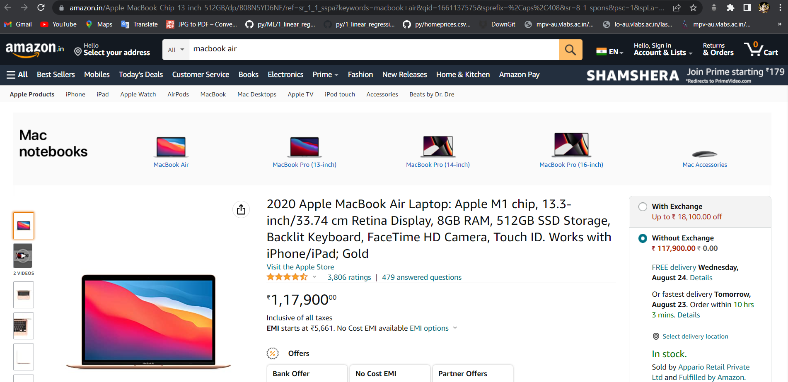
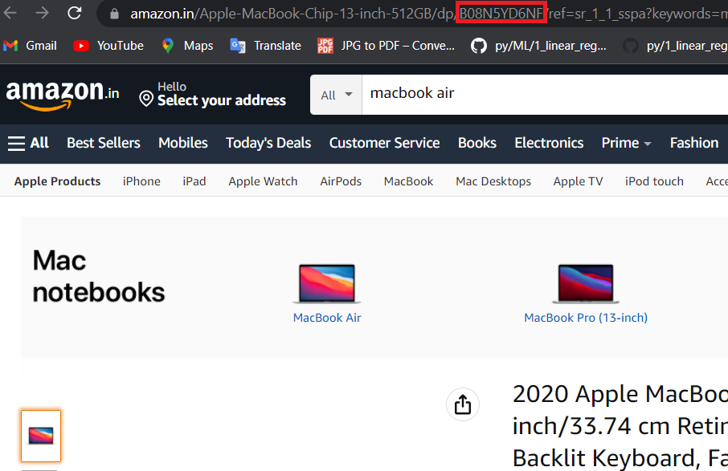

# Amazon-Web-Scraper-API

### This is a basic Amazon Web Scraper API created with the help of express.js where the user can:

01) GET all details of a particular product using the ID of that particular product.

02) GET all reviews of a particular product with using the ID of that particular product.

03) GET all the offers that is going on for that particular product using the ID of that particular product.

04) Search for a particular product.

# Steps to get product ID of any product from Amazon

## Step 1

Visit amazon website.

## Step 2

Choose any product.

Here, you can see, I chose ***Macbook Air***

## Step 3

After you have selected your desired product, you can see the ID of that product in the URL section

## Step 4

Just copy that ID and paste it in the routes of this API to get the desired results.